# Kantorei — Anleitung

Diese Anleitung führt durch alle Bereiche des Notenarchivs, mit Bildern aus der laufenden
Anwendung. Dieselben Seiten findest du später **in der App unter „Hilfe"** — dort sind sie
immer auf dem Stand deiner Installation.

Zum Aufsetzen siehe [README](README.md#schnellstart); wer rechtliche Fragen zu Noten hat,
findet sie in [RECHTLICHES.md](RECHTLICHES.md).

**Inhalt**

| | |
|---|---|
| [Anmelden](#anmelden) | [Sammlungen](#sammlungen) |
| [Finden: Katalog & Suche](#finden-katalog--suche) | [Dienste: Chor, Termine, Zusagen](#dienste-chor-termine-zusagen) |
| [Ein Werk öffnen](#ein-werk-öffnen) | [ChordPro: Text & Akkorde](#chordpro-text--akkorde) |
| [Ansehen, Spielmodus & Notizen](#ansehen-spielmodus--notizen) | [Metronom](#metronom) |
| [Setlisten](#setlisten) | [Einstellungen](#einstellungen) |
| [Projektion & Drucken](#projektion--drucken) | [Benutzer](#benutzer) |

---

## Erste Schritte

Nach der Installation existiert **kein** Konto. Der erste Admin wird auf der Kommandozeile
angelegt — eine Selbstregistrierung gibt es bewusst nicht:

```bash
docker compose exec app python -m app.cli create-admin <benutzername>
```

Der Befehl fragt das Passwort ab und zeigt eine **2FA-URI**, die du einmalig in deine
Authenticator-App einscannst. Danach meldest du dich im Browser an und legst unter
[Benutzer](#benutzer) die Konten für Chor und Mitmusiker an.

Ein leeres Archiv füllt sich auf zwei Wegen: Werke von Hand erfassen und Dateien hochladen,
oder mit den Skripten unter `scripts/` aus offenen Notenquellen importieren (siehe
[RECHTLICHES.md](RECHTLICHES.md)).

---

## Anmelden

Melde dich mit **Benutzername** und **Passwort** an. Ist die Zwei-Faktor-Anmeldung aktiv —
im Standard für alle Konten — kommt ein sechsstelliger Code aus deiner Authenticator-App
dazu. Konten legt ausschließlich der **Admin** an.

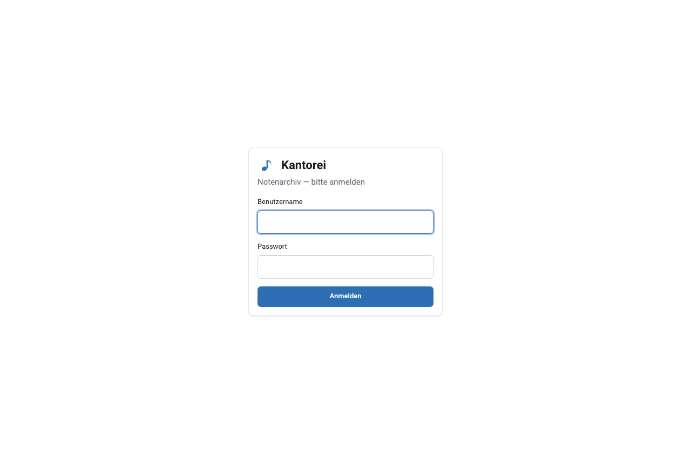

## Finden: Katalog & Suche

Der **Katalog** listet alle Werke. Oben schaltest du zwischen **Liste** und **Baum** um.

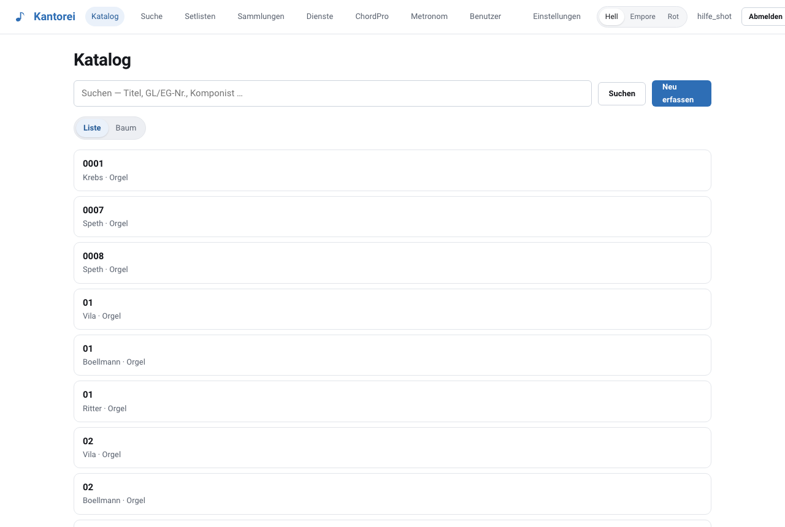

Im **Baum** gruppierst du nach **Komponist**, **Gattung** oder **Anlass** und klappst die
Gruppen auf — das trägt auch bei mehreren tausend Stücken.

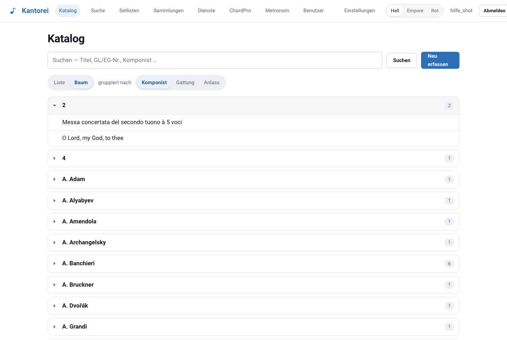

Über **Suche** findest du nach Titel, Komponist oder GL-/EG-Nummer, mit Filtern für Gattung,
Besetzung und Rechtestatus. Die Suche ist unscharf: Tippfehler und abweichende Schreibweisen
führen trotzdem zum Treffer.


## Ein Werk öffnen

Ein Klick auf ein Werk öffnet die Detailseite mit allen **Ausgaben & Dateien**. Je Blatt gibt
es **Ansehen**, **Spielen** (Spielmodus), **Notizen** und **Löschen**; über **Zu Setliste**
wandert das Stück in einen Ablauf, und rechts setzt du den **Rechtestatus**.


- **Bearbeiten ✎** / **Löschen** oben rechts: Titel, Komponist, Gattung ändern oder das Werk entfernen
- **Dateien hinzufügen**: PDF oder MusicXML per Klick oder Drag & Drop
- **Text & Akkorde (ChordPro)** und **Projektionstext** lassen sich weiter unten pflegen oder
  **aus den Noten erzeugen**

> **Rechtestatus:** Nur „gemeinfrei" und „lizenziert" dürfen gedruckt und gebündelt werden.
> Neue Uploads stehen auf „unbekannt" und sind damit vom Druck ausgeschlossen, bis du sie
> geprüft hast — Details in [RECHTLICHES.md](RECHTLICHES.md).

## Ansehen, Spielmodus & Notizen

- **Ansehen** öffnet das Notenblatt als PDF — schnell zum Durchblättern.
- **Spielmodus ▸** ist die Vollbild-Ansicht fürs Instrument und iPad: Tap-Zonen links und
  rechts zum Blättern, Zwei-Seiten-Ansicht, Auto-Scroll, Dunkel- und Rotlicht-Modus,
  „an Fenster anpassen" — und Bedienung per **Bluetooth-Fußpedal**.
- **Notizen ✎**: direkt auf dem Blatt zeichnen oder Text setzen (verschiebbar, in der
  Schriftgröße anpassbar). Die Noten liegen unberührt darunter; Notizblätter lassen sich
  ansehen, spielen, drucken und versenden.

## Setlisten

Eine **Setliste** ist die Reihenfolge für einen Gottesdienst oder ein Konzert.

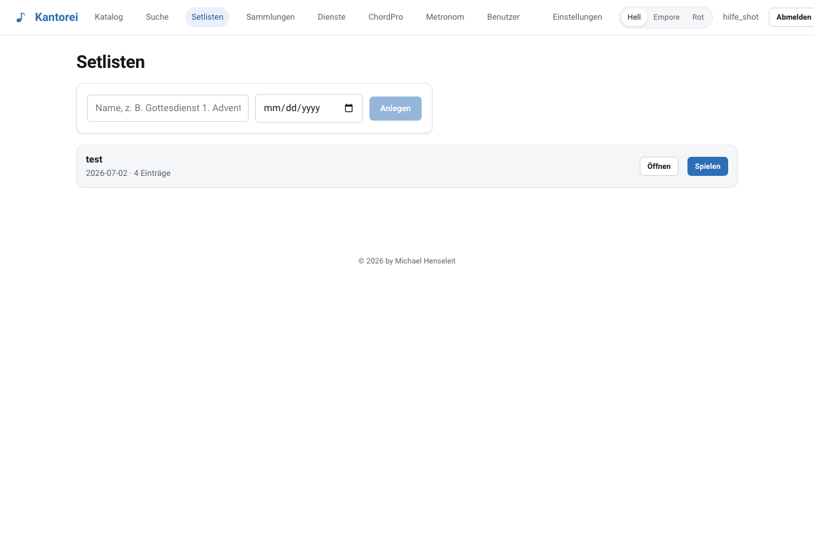

In der Setliste fügst du Werke hinzu — mit Wahl von **Blatt** und **Seitenbereich** — und
**Zwischenüberschriften** zum Gliedern. Einträge lassen sich per ✎ ändern, mit ↑ ↓ umsortieren
und per Klick direkt öffnen.

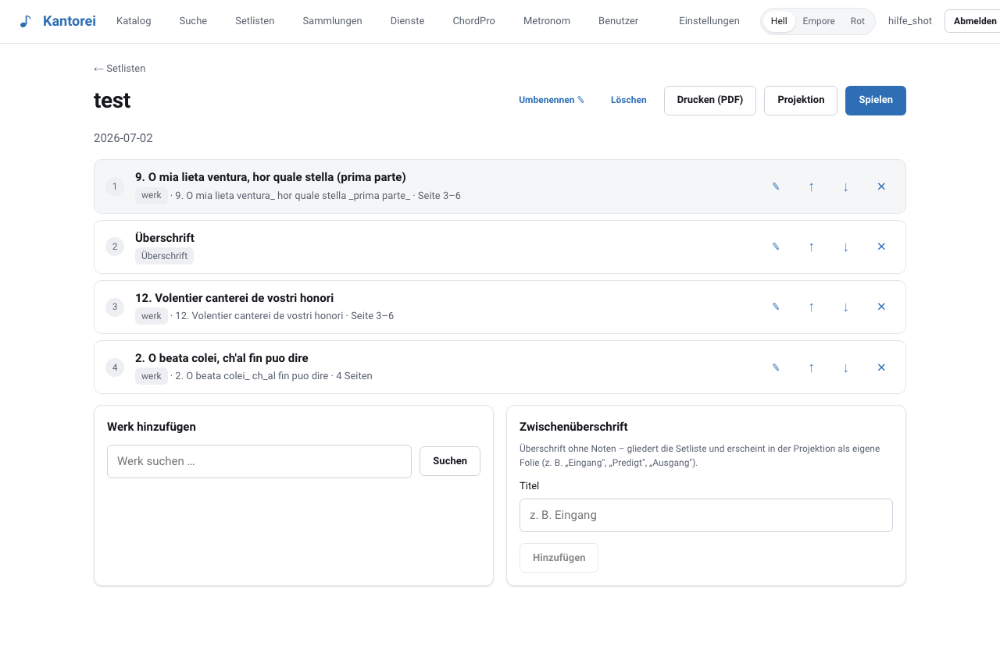

## Projektion & Drucken

- **Spielen**: die ganze Setliste am Stück im Spielmodus.
- **Projektion** für den Beamer: umschaltbar zwischen **Titel**, **Liedtext**, **Noten** und
  **beidem**. Weiter geht es mit den Pfeiltasten oder durch Tippen links und rechts.
- **Drucken (PDF)**: erzeugt ein Sammel-PDF der Setliste, auf **A4** normalisiert und mit
  **Bundsteg** zum Binden. Stücke mit ungeklärtem Rechtestatus bleiben außen vor.

## Sammlungen

**Sammlungen** sind thematische Unter-Bibliotheken, etwa „Orgel-Repertoire" oder „Chor".
Du legst eine an, fügst Werke aus dem Katalog hinzu und benennst oder löschst sie in der
Detailansicht.

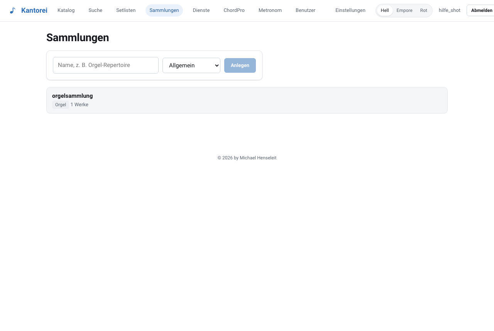

## Dienste: Chor, Termine, Zusagen

Unter **Dienste** verwaltest du **Gruppen** (Chor, Bläser, Band), ihre **Mitglieder** und die
**Termine** — als Liste oder im **Kalender**.

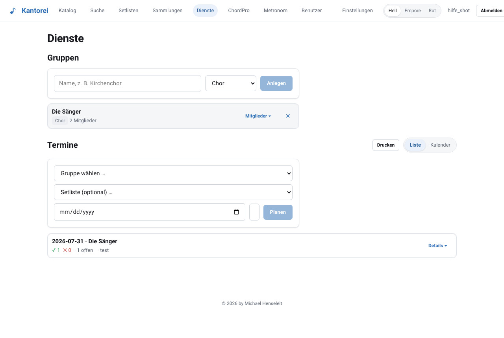

- **Meine Dienste** ganz oben: Jede und jeder sieht die eigenen Termine und sagt zu
  („Ich kann ✓") oder ab, wahlweise mit Notiz.
- Die verantwortliche Person sieht je Termin **alle Zu- und Absagen** und kann Datum,
  Setliste und Notiz ändern.
- **Drucken**: der ganze Dienstplan mit Gruppen, Mitgliedern und Status.

## ChordPro: Text & Akkorde

**ChordPro** zeigt Akkorde direkt **über den Silben**. Du musst keine Syntax tippen — nutze
die **Token** zum Anklicken oder Hineinziehen. Mit **Halbtöne −/+** transponierst du alles auf
einmal, etwa für eine andere Stimmlage. Das Ergebnis lässt sich mit **Griffbildern** drucken,
speichern und versenden; zu jedem Werk kann ChordPro auch **aus den Noten erzeugt** werden.

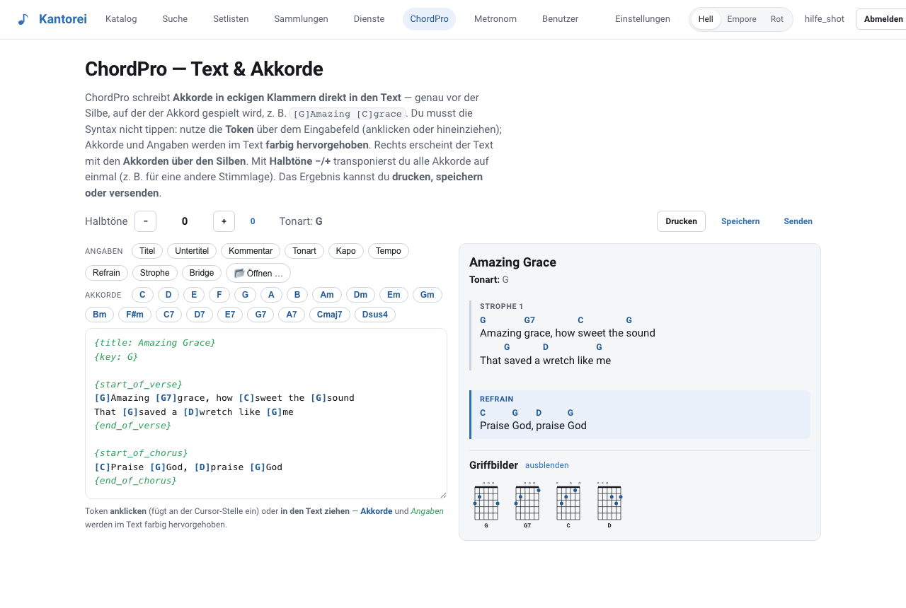

## Metronom

Ein einfaches **Metronom** mit Tempo, Taktart und Tap-Tempo.

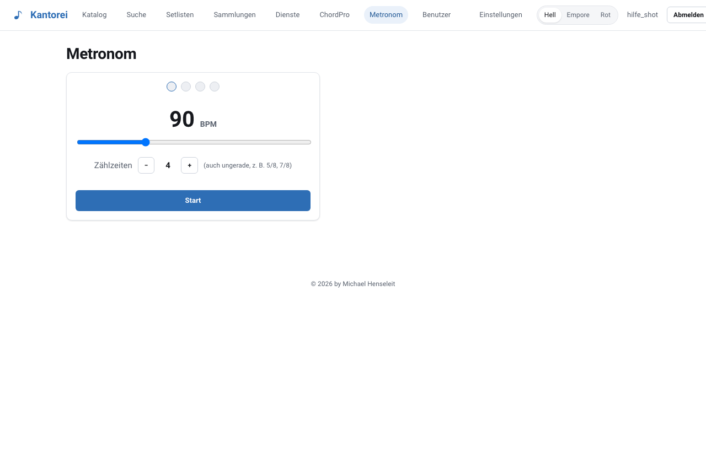

## Einstellungen

Hier änderst du dein **Passwort**. Als **Admin** pflegst du zusätzlich:

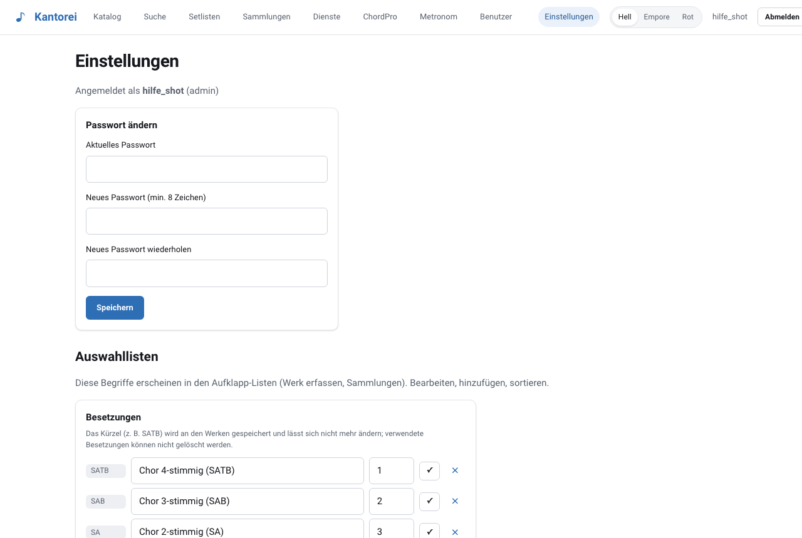

- **Auswahllisten**: Besetzungen, Sammlungs-Arten und Anlässe — also die Aufklapp-Listen
  beim Erfassen.
- **Rechtestatus als Massen-Aktion**: vielen Ausgaben auf einmal einen Status geben, etwa den
  gemeinfreien Bestand fürs Drucken freigeben.
- **Backup**: Ziel, Aufbewahrung und Uhrzeit der nächtlichen Sicherung. *(Im Docker-Betrieb
  übernimmt das der `backup`-Container; siehe [docker/README.md](docker/README.md#sicherung).)*
- **Aufgaben & Import**: längere Aufgaben wie Noten-Import oder Analyse anstoßen und den
  **Fortschritt** live verfolgen.

## Benutzer

Nur für Admins. Hier legst du **Konten** an (kein Self-Signup), vergibst Rollen — Admin,
Musiker, Chor, Gast —, setzt bei Bedarf ein neues Passwort, schaltest **2FA** pro Person ein
oder aus und löschst Konten. Der letzte aktive Admin ist gegen Löschen geschützt, damit sich
niemand aus der eigenen Installation aussperrt.

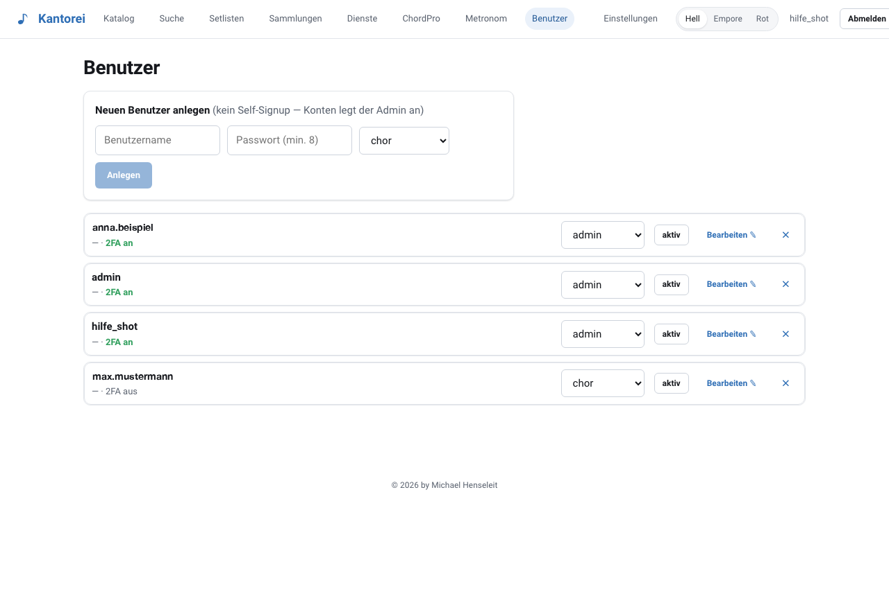

---

Klemmt etwas? Frag deinen Admin — oder lade die Seite einmal hart neu, falls eine neue Version
bereitsteht. Fehler und Vorschläge gehören in die
[Issues](https://github.com/kantorei-noten/noten-orga/issues); Sicherheitslücken bitte
vertraulich nach [SECURITY.md](SECURITY.md).
