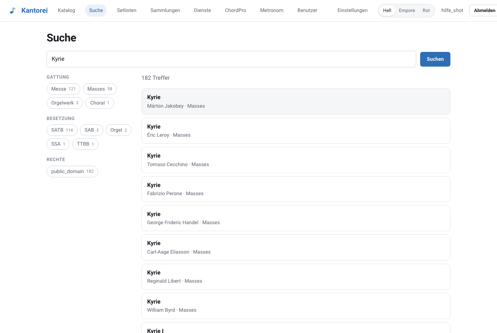
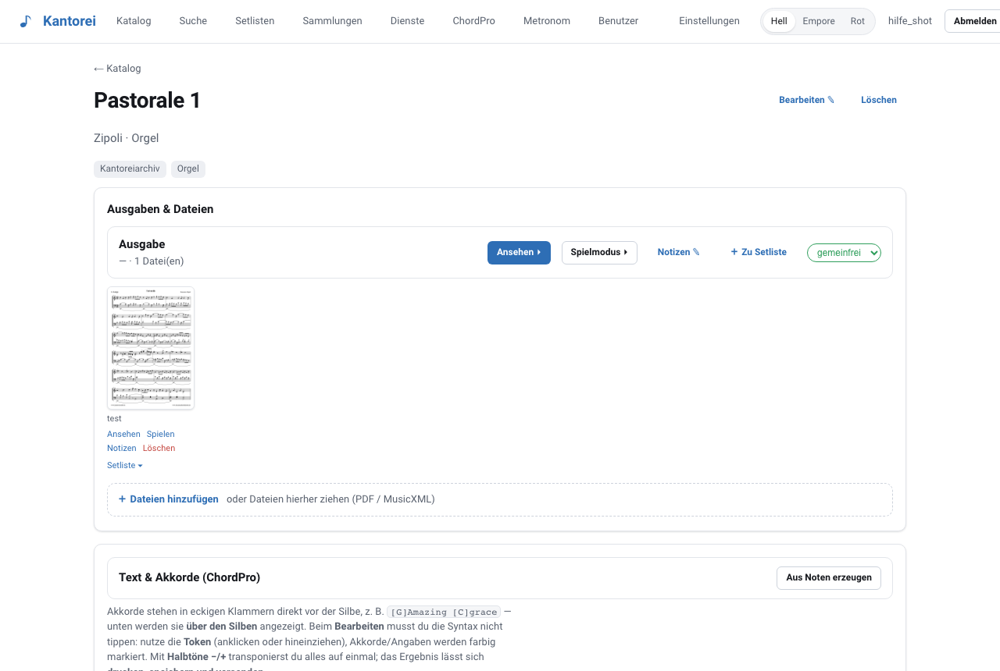

<div align="center">


# Kantorei — Notenarchiv für Kirchenmusik

**Noten digitalisieren, katalogisieren, am Instrument spielen und drucken.**
Selbstgehostet, ohne Cloud, ohne Abo — ein Container-Stack, den man in fünf Minuten startet.

[](https://github.com/kantorei-noten/noten-orga/actions/workflows/ci.yml)
[](LICENSE)

</div>

Kantorei ist für Kirchenmusikerinnen und Kirchenmusiker gebaut, die ein gewachsenes Notenarchiv
haben: Ordner voller Kopien, Sammelbände, lose Blätter. Gescannt landet alles hier — auffindbar
nach Titel, Komponist, Gotteslob-/EG-Nummer, Anlass und Besetzung, spielbereit auf dem iPad am
Instrument und druckbar als fertige Gottesdienst-Mappe.

<div align="center">



**→ [Alle Bereiche mit Bildern: die Anleitung](ANLEITUNG.md)**

</div>

## Funktionen

**Archiv**
- Katalog als Liste oder aufklappbarer **Baum**, gruppiert nach Komponist, Gattung oder Anlass —
  auch bei mehreren tausend Stücken übersichtlich
- Volltextsuche (deutsch, mit unscharfer Treffersuche) über Titel, Komponist, GL-/EG-Nummer,
  mit Filtern für Gattung, Besetzung und Rechtestatus
- Datenmodell Werk → Ausgabe → Datei → Stimme: mehrere Editionen und Einzelstimmen pro Werk
- Upload von **PDF** und **MusicXML/.mxl** per Drag & Drop, mit Vorschaubildern und Dedup über Hash

**Am Instrument**
- **Spielmodus**: Vollbild, Tap-Zonen links/rechts zum Blättern, Zwei-Seiten-Ansicht, Auto-Scroll,
  Dunkel- und Rotlicht-Modus, „an Fenster anpassen" — bedienbar per **Bluetooth-Fußpedal**
- **Notizen** direkt aufs Blatt zeichnen oder als Text setzen; das Notenblatt bleibt unberührt
- MusicXML wird mit **Verovio** gerendert und lässt sich transponieren
- **PWA**: installierbar auf iPad, Handy und Desktop, bereits geöffnete Inhalte bleiben offline verfügbar

**Gottesdienst und Probe**
- **Setlisten** mit Seitenbereichen und Zwischenüberschriften; als Ganzes spielbar
- **Projektion** für den Beamer: Titel, Liedtext, Noten oder beides
- **Drucken**: Sammel-PDF der Setliste, auf A4 normalisiert, mit Bundsteg zum Binden
- **Dienste**: Gruppen (Chor, Bläser, Band), Termine, Zu- und Absagen der Mitglieder, Kalender,
  Dienstplan zum Ausdrucken
- **ChordPro**: Akkorde über den Silben, transponierbar, mit Griffbildern — auf Wunsch automatisch
  aus den Noten erzeugt (Harmonieanalyse mit music21 im Worker-Container)
- **Metronom**

**Verwaltung**
- Benutzer mit den Rollen `admin`, `musiker`, `chor`, `gast` — **keine Selbstregistrierung**,
  Konten legt ausschließlich ein Admin an
- **Pflicht-2FA** (TOTP) für alle Konten
- Rechtestatus je Ausgabe; Drucken und Bündeln sind für ungeklärte Stücke gesperrt
  (siehe [RECHTLICHES.md](RECHTLICHES.md))
- Nächtliche Sicherung von Datenbank und Notendateien, im Stack enthalten

## Schnellstart

Voraussetzung: ein Linux-Server, NAS oder Mac/PC mit **Docker** und Docker Compose.

```bash
git clone https://github.com/kantorei-noten/noten-orga.git
cd noten-orga/docker
./setup.sh                 # erzeugt .env mit zufälligen Passwörtern, fragt nach der Domain
docker compose up -d       # lädt die Images und startet den Stack
docker compose exec app python -m app.cli create-admin <benutzername>
```

Der letzte Befehl fragt das Passwort ab und zeigt die **2FA-URI**, die einmalig in die
Authenticator-App eingescannt wird. Wie es danach weitergeht, zeigt die
**[Anleitung](ANLEITUNG.md)** — alle Bereiche mit Bildern. Die App erreichst du:

- **mit Domain** unter `https://<deine-domain>` — Caddy holt das Let's-Encrypt-Zertifikat
  automatisch, sobald der A-Record auf den Server zeigt
- **ohne Domain** unter `http://localhost` (dann ohne HTTPS, nur fürs Ausprobieren)

Läuft auf einem NAS bereits etwas auf Port 80/443, setze `NOTEN_HTTP_PORT` / `NOTEN_HTTPS_PORT`
in der `.env`.

**Systemanforderungen:** 2 GB RAM reichen für den Grundbetrieb, 4 GB sind mit music21-Worker
komfortabel; Plattenplatz nach Archivgröße (gescannte Orgelliteratur: grob 1–5 MB je Stück).
Images gibt es für **amd64 und arm64** (Raspberry Pi 4/5, ARM-NAS, Apple Silicon).

## Betrieb

**Aktualisieren** — empfohlen mit festem Release-Tag in der `.env` (`NOTEN_VERSION=v1.0.0`):

```bash
cd noten-orga/docker
docker compose pull && docker compose up -d    # Migrationen laufen beim Start automatisch
```

**Sicherung** — der `backup`-Container legt jede Nacht (Standard 03:30) unter `NOTEN_BACKUP_DIR`
ein Verzeichnis mit `db.sql.gz`, `data.tar.gz` und `SHA256SUMS` an; ältere werden nach
`NOTEN_BACKUP_KEEP_DAYS` Tagen entfernt. Sofort sichern:

```bash
docker compose run --rm backup once
```

**Zurückspielen** aus einer Sicherung:

```bash
docker compose stop app worker
gunzip -c <sicherung>/db.sql.gz | docker compose exec -T db psql -U noten_app -d noten
docker run --rm -v noten_data:/data -v "<sicherung>":/sicherung alpine \
  sh -c 'rm -rf /data/* && tar -xzf /sicherung/data.tar.gz -C /data'
docker compose start app worker
```

**Passwort oder 2FA verloren:** Ein Admin kann beides in der Benutzerverwaltung für andere
zurücksetzen. Ist der einzige Admin ausgesperrt, hilft ein neues Konto per
`docker compose exec app python -m app.cli create-admin <name>`.

Mehr Details, auch zu Fehlersuche und Aufbau des Stacks: [`docker/README.md`](docker/README.md).

## Sicherheit

Die Anwendung ist dafür gebaut, offen im Internet zu stehen:

- **Anmeldung:** Argon2id, Pflicht-TOTP, kein Self-Signup, Rate-Limit und Sperre nach
  Fehlversuchen, httpOnly/SameSite-Cookies
- **Uploads gelten als feindlich:** Prüfung der Magic Bytes, harte Größen- und Seitenlimits,
  XML ausschließlich über `defusedxml` (kein XXE), Schutz gegen Zip-Bomben und Zip-Slip.
  Das eigentliche Parsen läuft in einem **eigenen Subprozess** mit RAM-, CPU- und Zeitlimit;
  optional lässt sich ClamAV anbinden
- **Angriffsfläche klein:** nur Caddy veröffentlicht Ports (80/443), Datenbank, App und Worker
  bleiben im internen Netz; Container laufen als Nicht-Root; im Produktivmodus gibt es keine
  OpenAPI-Oberfläche; CSP, HSTS und `X-Frame-Options: DENY` setzt Caddy

Sicherheitslücken bitte nach [SECURITY.md](SECURITY.md) melden — nicht als öffentliches Issue.

## Entwicklung

```bash
uv sync                                   # Python 3.13, Abhängigkeiten aus uv.lock
scripts/devdb.sh                          # lokaler PostgreSQL-Cluster auf Port 5433 (macOS;
                                          #   sonst: docker run -p 5433:5432 postgres:17)
cp .env.example .env
uv run alembic upgrade head
uv run uvicorn app.main:app --reload      # API auf :8000
cd web && npm install && npm run dev      # PWA auf :5173
uv run pytest -q                          # Tests
```

Aus dem Quellcode bauen statt fertige Images zu laden:

```bash
cd docker && docker compose -f compose.yaml -f compose.build.yaml up -d --build
```

**Aufbau:** FastAPI (Python 3.13) + PostgreSQL 17 mit `tsvector`/`pg_trgm` für die Suche,
Alembic-Migrationen, Objektspeicher im Dateisystem mit Hash-Dedup, Job-Queue für schwere
Aufgaben im Worker-Container. Frontend: Vue 3 als PWA, pdf.js für Scans, Verovio für MusicXML.
Ausgeliefert wird von Caddy, das auch das TLS-Zertifikat besorgt.

## Beitragen

Fehlermeldungen und Vorschläge sind willkommen — siehe [CONTRIBUTING.md](CONTRIBUTING.md).
Das Projekt entsteht für die Praxis einer Kirchenmusikstelle; Funktionen, die dort keinen
Nutzen haben, bleiben bewusst außen vor.

## Lizenz

**AGPL-3.0-or-later** — siehe [LICENSE](LICENSE). Wer eine geänderte Fassung über ein Netzwerk
anbietet, muss deren Quellcode zugänglich machen (§13). Die eingesetzten Fremdkomponenten und
ihre Lizenzen listet [THIRD-PARTY.md](THIRD-PARTY.md).

Es werden **keine Noten mitgeliefert**. Was du einstellst und ob du es drucken, aufführen oder
weitergeben darfst, verantwortest du selbst — [RECHTLICHES.md](RECHTLICHES.md) erklärt, worauf
zu achten ist.

© 2026 Michael Henseleit
